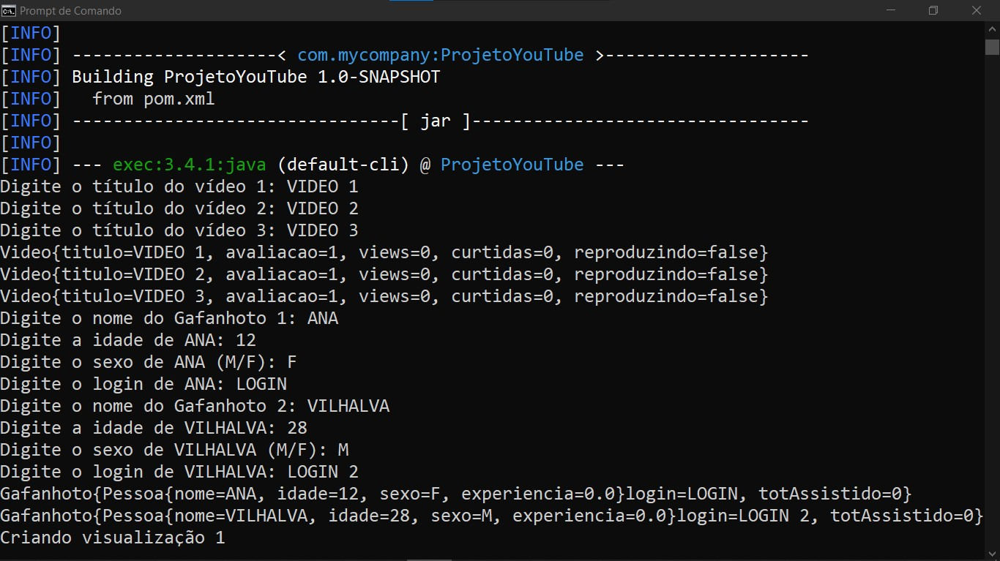

# PROJETO YOUTUBE
👨‍🏫PROJETO CRIADO PARA O CURSO DE JAVA DO CURSO EM VIDEO.

 <br>

## DESCRIÇÃO:
Esse projeto é uma simulação de uma plataforma de vídeos semelhante ao YouTube, onde os usuários (chamados de **Gafanhotos** no projeto) podem visualizar e avaliar vídeos. Ele utiliza conceitos de Programação Orientada a Objetos (POO) como classes, objetos, herança e polimorfismo. O código cria instâncias de vídeos e usuários, além de permitir que o usuário avalie os vídeos após visualizá-los.

## COMPONENTES PRINCIPAIS:
1. **Classe `Video`**:
   Representa os vídeos da plataforma. Cada vídeo possui um título e pode ser avaliado.

2. **Classe `Gafanhoto`**:
   Representa os usuários da plataforma que podem visualizar e avaliar vídeos. Contém atributos como nome, idade, sexo e login.

3. **Classe `Visualizacao`**:
   Registra uma interação entre um Gafanhoto e um vídeo. Permite que o Gafanhoto assista a um vídeo e, se desejar, faça uma avaliação desse vídeo.

## DESCRIÇÃO DE CADA CLASSE:
- **`Video`**: Contém informações como título, visualizações, avaliações e número de curtidas. Também tem métodos para manipular essas propriedades.
- **`Gafanhoto`**: Extende uma classe base chamada `Pessoa`, armazenando informações sobre o usuário, como idade e login.
- **`Visualizacao`**: Relaciona um Gafanhoto a um vídeo específico e permite que o Gafanhoto avalie o vídeo.

## FUNCIONAMENTO:
1. O programa começa solicitando ao usuário informações para criar três vídeos.
2. Em seguida, ele pede que o usuário forneça informações para dois Gafanhotos (usuários).
3. Após isso, o programa cria visualizações onde os Gafanhotos assistem a determinados vídeos, e então pergunta se o usuário deseja avaliar o vídeo assistido.
4. No final, o programa exibe informações detalhadas sobre os vídeos, os Gafanhotos e as visualizações, incluindo as avaliações feitas.

## EXECUTANDO O PROJETO:
1. **Certifique-se de que o projeto esteja compilado:**
   Antes de executar o projeto, você deve garantir que ele foi compilado corretamente. Navegue até o diretório `./CODIGO`, e use o seguinte comando para compilar:

   ```bash
   mvn clean install
   ```

2. **Executar o projeto:**
   Para executar a aplicação com o Maven, usando a classe principal definida no seu `pom.xml`, use o comando:

   ```bash
   mvn exec:java
   ```

3. **Passos para execução**:
   - Ao iniciar o programa, ele solicitará que você insira informações sobre os vídeos e os Gafanhotos.
   - Depois, o programa pedirá que você selecione um Gafanhoto e um vídeo para criar visualizações.
   - Você terá a opção de avaliar os vídeos assistidos com uma nota de 0 a 100 ou usar uma avaliação padrão.
   
4. **Entradas**:
   - **Vídeos**: Você precisará digitar o título dos vídeos que serão criados.
   - **Gafanhotos**: Será solicitado o nome, idade, sexo e login para cada Gafanhoto.
   - **Visualizações**: Escolha um Gafanhoto e um vídeo para associar e decidir se deseja ou não avaliar o vídeo.

## CREDITOS:
- [PROJETO CRIADO PARA O CURSO DE JAVA](https://github.com/VILHALVA/CURSO-DE-JAVA)
- [PROJETO FEITO PELO VILHALVA](https://github.com/VILHALVA)


